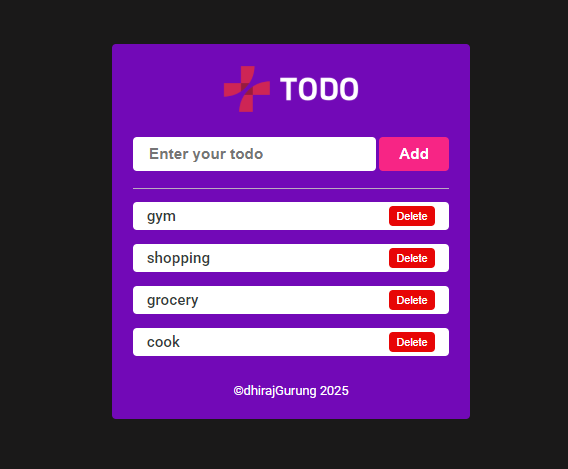

# To-Do List App

A simple to-do list application that allows users to add tasks, view them, and delete them. The app saves tasks to `localStorage` so they persist even after the page is refreshed.

## Features

- Add tasks by typing in the input field and pressing the "Add" button or pressing Enter.
- Tasks are saved to `localStorage` and persist between page reloads.
- complete task by clicking on task text ,you can see lind go-through text.
- Remove tasks by clicking the "Delete" button next to each task.
- The color of the input text changes as you type.

## How to Run

1. Clone or download the project.
2. Open `index.html` in your browser.
3. Start using the to-do list app.

## File Structure

- `index.html`: The main HTML file containing the structure of the app.
- `styles.css`: The CSS file for styling the app.
- `app.js`: The JavaScript file that handles the functionality of the app.

## Technologies Used

- HTML5
- CSS3
- JavaScript (Vanilla)

## Example

After loading the app, you'll see an input field where you can add tasks. The tasks will be displayed in a list, and you can delete them by clicking the "Delete" button.

### Screenshot

link:https://gdhiraj030.github.io/TODO/

## License

This project is licensed under the MIT License - see the [LICENSE](LICENSE) file for details.
